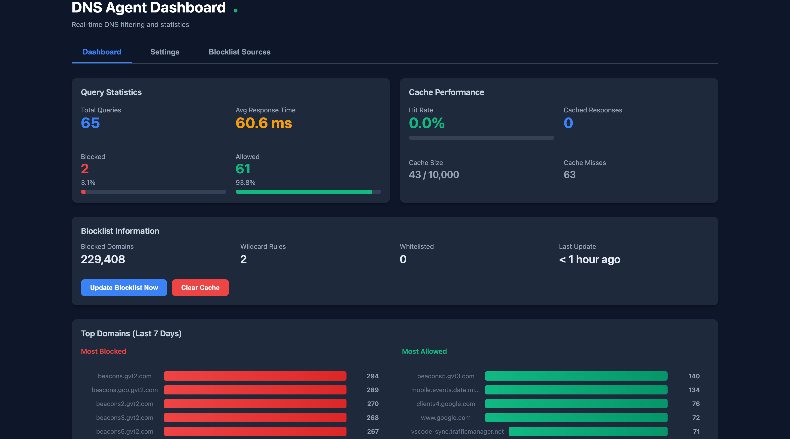
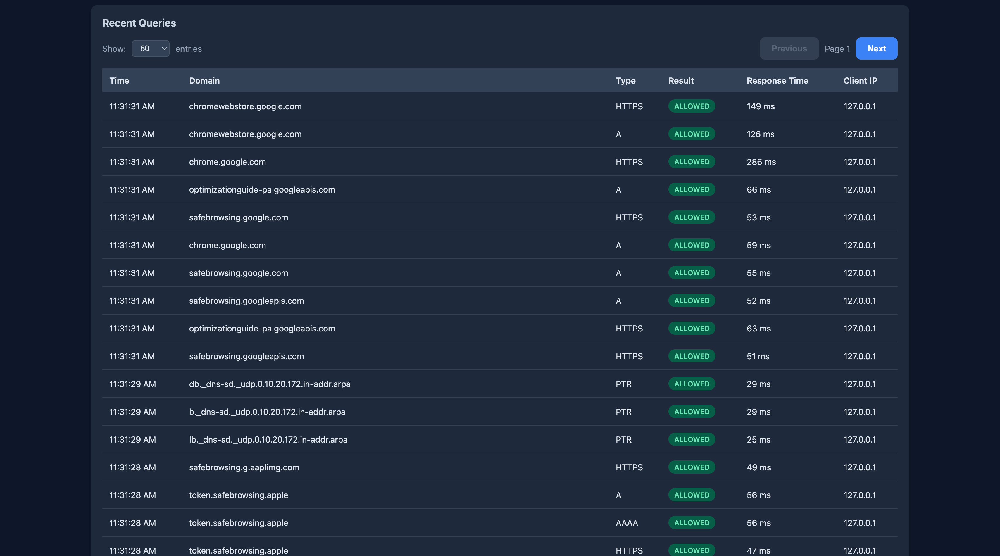
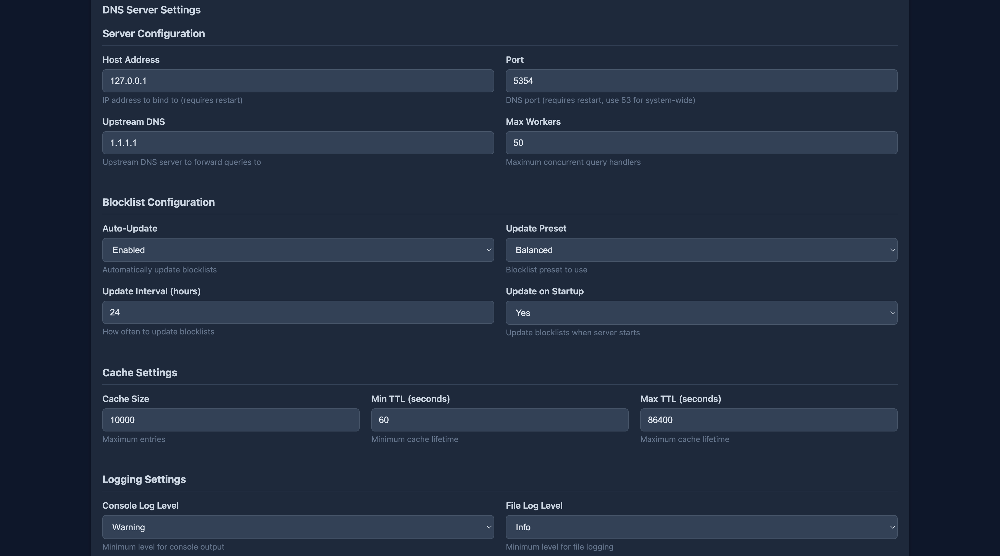
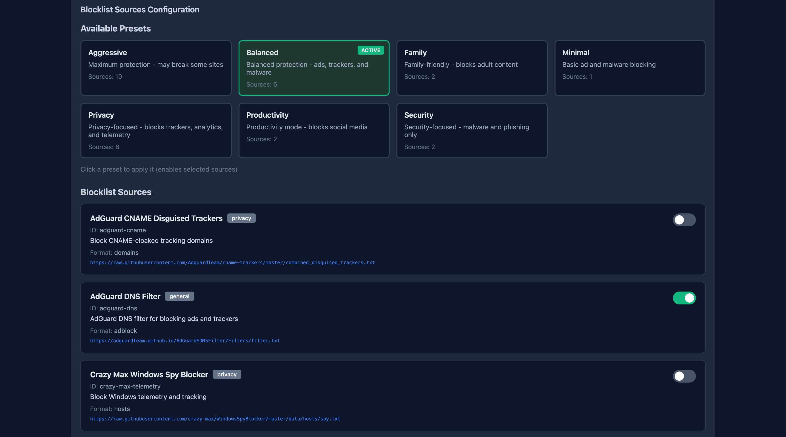

# DNS Agent

A simple DNS sinkhole CLI tool for blocking ads, trackers, and malware at the DNS level.

## About

This project was inspired by [Goaway](https://github.com/AkaruiDevelopment/goaway). I wanted to learn more about how DNS works and what's happening on my network, so I built this small tool as a learning exercise.

**Disclaimer:** This is not a professional tool. It started as a more complex project and was simplified down to what it is now. It works for my personal needs and was primarily built to understand DNS better. Use at your own discretion.

## Features

- DNS query blocking using community blocklists
- Response caching for faster lookups
- Web dashboard for monitoring queries
- Automatic DNS management (sets system DNS on start, restores on stop)
- Cross-platform support (macOS, Windows, Linux)

## Quick Start

```bash
# Install
uv tool install git+https://github.com/MHElnour/dns-agent.git@v0.1.3

dnsagent --port 53

# Run without DNS management
dnsagent --no-manage-dns --port 53

# Stop with Ctrl+C (restores original DNS)
```

## Usage

```text
dnsagent --help

options:
  -h, --help           show this help message and exit
  --config CONFIG      Path to config file
  --host HOST          Override host from config
  --port PORT          Override port from config
  --upstream UPSTREAM  Override upstream DNS from config
  --manage-dns         Automatically manage system DNS settings (default: enabled)
  --no-manage-dns      Do NOT automatically manage system DNS settings
```

## Dashboard

Once running, access the web dashboard at `http://127.0.0.1:9880`

### Main Dashboard



### Query Log



### Settings



### Blocklist Sources



## Configuration

Config files are stored in:

- **macOS**: `~/Library/Application Support/DNSAgent/`
- **Windows**: `%APPDATA%/DNSAgent/`
- **Linux**: `~/.config/DNSAgent/`

## License

MIT
